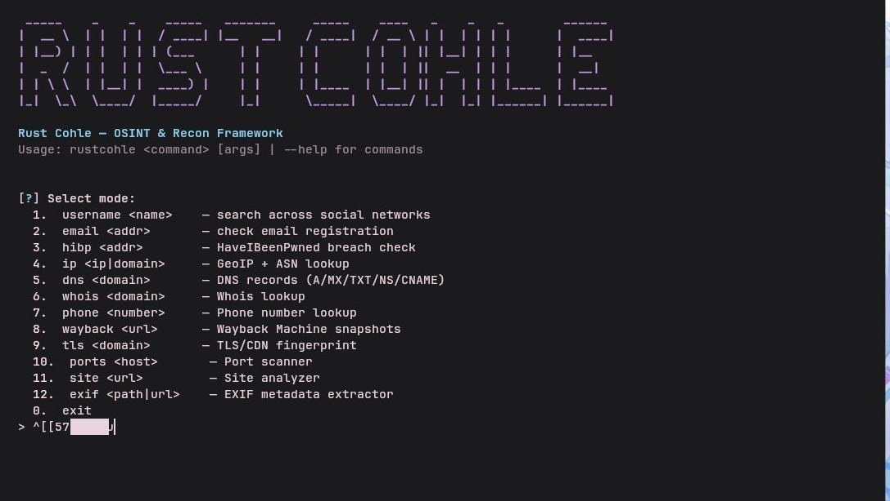

# rustcohle

osint & recon framework на rust

## возможности

[+] поиск аккаунтов по нику на 28 платформах
[+] проверка email на регистрацию в сервисах
[+] поиск email в базах утечек (hibp)
[+] dns записи (a, aaaa, mx, ns, txt, cname, soa)
[+] whois через rdap
[+] geoip + asn по ip или домену
[+] определение реального ip за cloudflare через spf и crt.sh
[+] архивные снимки сайта (wayback machine)
[+] сканер портов (common / web / full)
[+] exif из фото, координаты если есть
[+] анализ сайта: заголовки, технологии, security headers
[+] определение страны по номеру телефона

## установка

git clone https://github.com/anonyrecidivism/rustcohle
cd rustcohle
cargo build --release

## использование

./rustcohle username <ник>
./rustcohle email <почта>
./rustcohle hibp <почта>
./rustcohle tls <домен>
./rustcohle dns <домен>
./rustcohle whois <домен>
./rustcohle ip <ip или домен>
./rustcohle phone <номер>
./rustcohle wayback <url>
./rustcohle ports <хост>
./rustcohle site <url>
./rustcohle exif <путь или url>

# без аргументов — интерактивное меню
./rustcohle